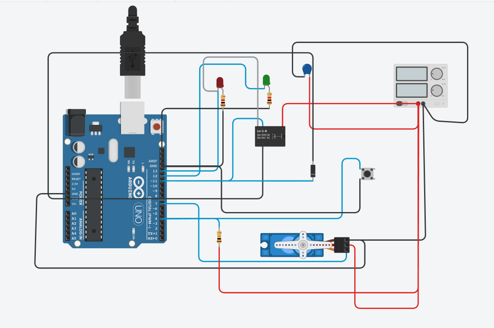

# Smart-Lock Face Recognition System

This project implements a high-accuracy facial recognition system using **DeepFace** and a custom **Keras/TensorFlow** neural network. The system is designed to identify authorized users and send a signal to an Arduino-controlled solenoid lock.

### 🚀 Features
* **Deep Learning Model:** Utilizes the `Facenet512` model for high-dimensional face embeddings.
* **High Confidence:** Achieved testing accuracy of 100% and real-time prediction confidence of 99.97%.
* **Preprocessing Pipeline:** Includes automated dataset loading, image resizing, and normalization.
* **Hardware Ready:** Code includes logic to interface with an Arduino via Serial communication.

### 🛠️ Tech Stack & Hardware
* **Software:** Python (DeepFace, TensorFlow, Keras)
* **Hardware:** Arduino Uno, Solenoid Lock, Relay Module
* **Simulation:** Tinkercad

### 📂 Project Files
* **`Face Detection based door lock.ipynb`**: The main Deep Learning pipeline.
* **`arduino_control.ino`**: C++ code to be uploaded to the Arduino.
* **`tinkercad-setup.png`**: Visual guide for the circuit wiring.

### ⚠️ Implementation Note
The physical hardware integration encountered a power/serial issue during testing. However, the logic is verified. Below is the circuit diagram showing how the Solenoid is triggered via the Relay on Pin 7:

### 🛠️ Hardware Setup (Tinkercad)

**Note on Simulation:** In the Tinkercad diagram above, the **Push Button** represents the signal received from the Python Face Recognition code. When the model identifies an authorized user, it sends a '1' via Serial, which triggers the Relay to open the Solenoid Lock.

### 📂 How to Use
1. Clone the repository.
2. Place authorized face images in the `known_faces/` directory.
3. Run the Jupyter Notebook to train the model and start the detection loop.
4. Connect your Arduino to the correct COM port (9600 baud) to trigger the physical lock.
